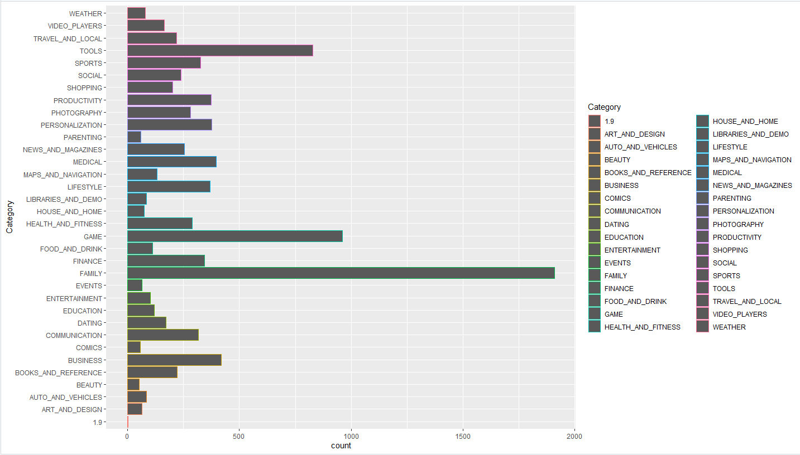

# Data Analysis with Descriptive Stat
## Pre-Steps: [Cleaning Data](./Cleaning%20Data/readme.md#cleaning-data)
## Questions
1. [หาจำนวนของแอปพลิเคชั่นที่มี Rating มากกว่า 4.5 เทียบกับแอปพลิเคชั่นทั้งหมด ?](#question-1-%E0%B8%AB%E0%B8%B2%E0%B8%88%E0%B8%B3%E0%B8%99%E0%B8%A7%E0%B8%99%E0%B8%82%E0%B8%AD%E0%B8%87%E0%B9%81%E0%B8%AD%E0%B8%9B%E0%B8%9E%E0%B8%A5%E0%B8%B4%E0%B9%80%E0%B8%84%E0%B8%8A%E0%B8%B1%E0%B9%88%E0%B8%99%E0%B8%97%E0%B8%B5%E0%B9%88%E0%B8%A1%E0%B8%B5-rating-%E0%B8%A1%E0%B8%B2%E0%B8%81%E0%B8%81%E0%B8%A7%E0%B9%88%E0%B8%B2-45-%E0%B9%80%E0%B8%97%E0%B8%B5%E0%B8%A2%E0%B8%9A%E0%B8%81%E0%B8%B1%E0%B8%9A%E0%B9%81%E0%B8%AD%E0%B8%9B%E0%B8%9E%E0%B8%A5%E0%B8%B4%E0%B9%80%E0%B8%84%E0%B8%8A%E0%B8%B1%E0%B9%88%E0%B8%99%E0%B8%97%E0%B8%B1%E0%B9%89%E0%B8%87%E0%B8%AB%E0%B8%A1%E0%B8%94-)
2. [หาจำนวนแอปพลิเคชั่นที่ฟรีกับแอปพลิเคชั่นที่มีราคา](#question-2-%E0%B8%AB%E0%B8%B2%E0%B8%88%E0%B8%B3%E0%B8%99%E0%B8%A7%E0%B8%99%E0%B9%81%E0%B8%AD%E0%B8%9B%E0%B8%9E%E0%B8%A5%E0%B8%B4%E0%B9%80%E0%B8%84%E0%B8%8A%E0%B8%B1%E0%B9%88%E0%B8%99%E0%B8%97%E0%B8%B5%E0%B9%88%E0%B8%9F%E0%B8%A3%E0%B8%B5%E0%B8%81%E0%B8%B1%E0%B8%9A%E0%B9%81%E0%B8%AD%E0%B8%9B%E0%B8%9E%E0%B8%A5%E0%B8%B4%E0%B9%80%E0%B8%84%E0%B8%8A%E0%B8%B1%E0%B9%88%E0%B8%99%E0%B8%97%E0%B8%B5%E0%B9%88%E0%B8%A1%E0%B8%B5%E0%B8%A3%E0%B8%B2%E0%B8%84%E0%B8%B2)
3. [หาแอปพลิเคชั่นที่มียอดรีวิวสูงสุดของกลุ่มฟรีและที่มีราคา](#question-3-%E0%B8%AB%E0%B8%B2%E0%B9%81%E0%B8%AD%E0%B8%9B%E0%B8%9E%E0%B8%A5%E0%B8%B4%E0%B9%80%E0%B8%84%E0%B8%8A%E0%B8%B1%E0%B9%88%E0%B8%99%E0%B8%97%E0%B8%B5%E0%B9%88%E0%B8%A1%E0%B8%B5%E0%B8%A2%E0%B8%AD%E0%B8%94%E0%B8%A3%E0%B8%B5%E0%B8%A7%E0%B8%B4%E0%B8%A7%E0%B8%AA%E0%B8%B9%E0%B8%87%E0%B8%AA%E0%B8%B8%E0%B8%94%E0%B8%82%E0%B8%AD%E0%B8%87%E0%B8%81%E0%B8%A5%E0%B8%B8%E0%B9%88%E0%B8%A1%E0%B8%9F%E0%B8%A3%E0%B8%B5%E0%B9%81%E0%B8%A5%E0%B8%B0%E0%B8%97%E0%B8%B5%E0%B9%88%E0%B8%A1%E0%B8%B5%E0%B8%A3%E0%B8%B2%E0%B8%84%E0%B8%B2)
4. [หาฐานนิยมของ Genres ?](#question-4-%E0%B8%AB%E0%B8%B2%E0%B8%90%E0%B8%B2%E0%B8%99%E0%B8%99%E0%B8%B4%E0%B8%A2%E0%B8%A1%E0%B8%82%E0%B8%AD%E0%B8%87-genres-)
5. [นับจำนวนของแอปพลิเคชั่นแต่ละประเภทโดยแสดงผลในรูปของกราฟ ?](#question-5-นับจำนวนของแอปพลิเคชั่นแต่ละประเภทโดยแสดงผลในรูปของกราฟ-)
6. [ให้ทำกราฟแสดงความสัมพันธ์ของ Ratiog และ Paid Apps ?](#question-6-ให้ทำกราฟแสดงความสัมพันธ์ของ-ratiog-และ-paid-apps-)
## Question 1: หาจำนวนของแอปพลิเคชั่นที่มี Rating มากกว่า 4.5 เทียบกับแอปพลิเคชั่นทั้งหมด ?
สร้าง gApp เอาไว้เก็บ app ทั้งหมดที่มีชื่อไม่ซ้ำกัน (จะเอาไว้ใช้กับอีกหลายข้อ)
```
gApp <- ggp %>% distinct(App, .keep_all = TRUE)
```

```
gApp <- ggp %>% distinct(App, .keep_all = TRUE)
count(gApp %>% filter(Rating >= 4.5))
count(gApp)
```
Result:

```
2551
9660
```
- Summary <br>
แอปพลิเคชั่นที่มี Rating มากกว่า 4.5 มีเพียง 2551 จาก 9660 แอปพลิเคชั่นตัวอย่าง
## Question 2: หาจำนวนแอปพลิเคชั่นที่ฟรีกับแอปพลิเคชั่นที่มีราคา
```
count(gApp %>% filter(Price == 0))
count(gApp %>% filter(Price != 0))
```
Result:
```
     n
1 8903
    n
1 756
```
-Summary <br>
มีแอปพลิเคชั่นฟรีถึง 8903 และแอปพลิเคชั่นเสียเงินเพียง 756 แอปพลิเคชั่น


## Question 3: หาแอปพลิเคชั่นที่มียอดรีวิวสูงสุดของกลุ่มฟรีและที่มีราคา?
กลุ่มฟรี
```
gApp %>% filter(Reviews == max(ggp %>% filter(Price == 0) %>% select(Reviews),na.rm = TRUE)) %>% select(App, Reviews)
```
Result:
```
       App  Reviews
1 Facebook 78158306
```
กลุ่มมีราคา
```
gApp %>% filter(Reviews == max(ggp %>% filter(Price != 0) %>% select(Reviews),na.rm = TRUE)) %>% select(App, Reviews)
```
Result:
```
        App Reviews
1 Minecraft 2376564
```

- Summary <br>
แอปพลิเคชั่นกลุ่มฟรีที่มียอดรีวิวสูงสุดคิอ Facebook ส่วนแอปพลิเคชั่นเสียเงินที่มียอดรีวิวสูงสุดคือเกม Minecraft

## Question 4: หาฐานนิยมของ Genres ?
```
my_mode <- function(x) {                     # Create mode function 
  unique_x <- unique(x)
  tabulate_x <- tabulate(match(x, unique_x))
  unique_x[tabulate_x == max(tabulate_x)]
}

my_mode(ggp$Genres)
Mode(ggp$Genres)
```
Result:

```
Tools
828
```

- Summary <br>
Genre แอปพลิเคชั่นที่มีจำนวนเยอะที่สุดคือ Tools มีจำนวนแอปพลิเคชั่น 828

## Question 5: นับจำนวนของแอปพลิเคชั่นแต่ละประเภทโดยแสดงผลในรูปของกราฟ ?
```
bar <- ggp %>% 
  ggplot(aes(y=Category)) + geom_bar(aes(color=Category))

bar
```
Result:




- Summary <br>
กราฟแสดงจำนวนแอปพลิเคชั่นแต่ละ Category <br>
จะเห็นว่าแอปพลิเคชันประเภท Family มีออกมามากที่สุด


## Question 6: ให้ทำกราฟแสดงความสัมพันธ์ของ Ratiog และ Paid Apps ?
```
plot <- ggp %>% 
  filter(Price != 0 ) %>% 
  ggplot(aes(x=Rating,y=Price)) + ggtitle("Rating and Paid Apps Relations") + geom_point(aes(color=Price))

plot
```
Result:


- Summary <br>
กราฟแสดงความสัมพันธ์ของ Ratiog และ Paid Apps
